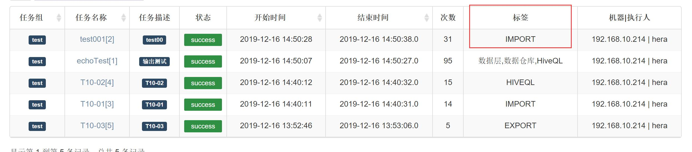
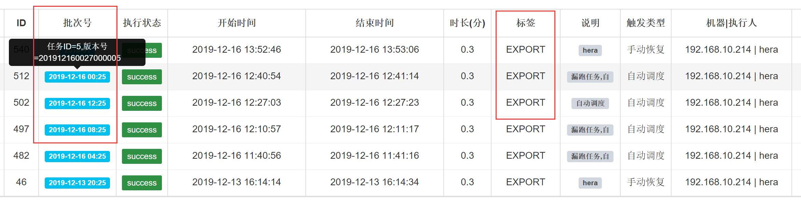

[TOC]

## 说明
引入批次号+业务标签，弱化版本号概念

​	作业：调度周期，基准日期间隔，业务标签； 

​	作业实例：批次号；

​	如jobA定义的调度周期=day,入参基准日期间隔=-1时，则版本号(id)=20191203010203xxxx的批次号=2019-01-02

​	附：对于业务来说，版本号太技术了，不容易理解。


## 功能

一、调度中心-作业-页面(查看与编辑)

 	1. 标签：作业的业务标签，多个标签逗号分隔
 	2. 调度周期：year,month,day,hour,minute,second,other(other当前等价于second)
 	3. 参数基准时间间隔: 数字值，如-1
 	4. 如jobA定义的调度周期=day,入参基准日期间隔=-1时，则版本号(id)=20191203010203xxxx的批次号=2019-01-02


二、任务详细-作业页面

1. 突出的标签的显示
2. 单个作业实例中，突出显示批次号，隐藏了版本号，ID信息







### hera meta 改动

一、表hera_job，增加3个字段----不改变原hera的调用逻辑；只是会结合版本号，得到作业实例的批次号信息。

```
cron_period varchar(50) DEFAULT 'other' COMMENT '调度周期(year,month,day,hour,minute,second,other)',
cron_interval int  DEFAULT 0 COMMENT '调度间隔，业务定义的日期与调度日期的间隔',
biz_label varchar(500) not null DEFAULT '' COMMENT '业务标签,逗号分隔'
```

二、表hera_action，增加1个字段批次号
如jobA定义的cron_period=day,cron_interval=-1时，则版本号(id)=20191203010203xxxx的批次号=20190102

```
batch_id varchar(50) DEFAULT NULL COMMENT '批次号',
```

三、hera_action_history表

```
  batch_id varchar(50) DEFAULT NULL COMMENT '批次号',
  biz_label varchar(500) DEFAULT NULL COMMENT '标签',
```


### hera脚本改动

HeraJob的实体与实体vo

jobAction的实体与实体vo

jobActionHistroy增加setBizLabel，setBatchId

```
1.com.dfire.controller.ScheduleCenterController
public JsonResponse execute方法 的actionHistory set两个setBizLabel，setBatchId

2.com.dfire.core.event.handler.JobHandler
startNewJob方法--build()前的两个setBizLabel，setBatchId

3. com.dfire.core.netty.master.Master
private void startNewJob方法--build()前的两个setBizLabel，setBatchId

4.com.dfire.core.netty.master.MasterRunJob
private void runScheduleJobContext方法--build()前的两个setBizLabel，setBatchId

```

JobHistoryVo

jobDetail.js

等