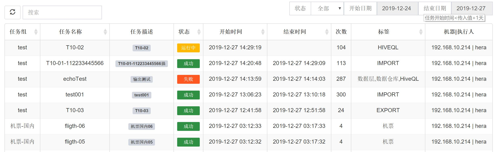
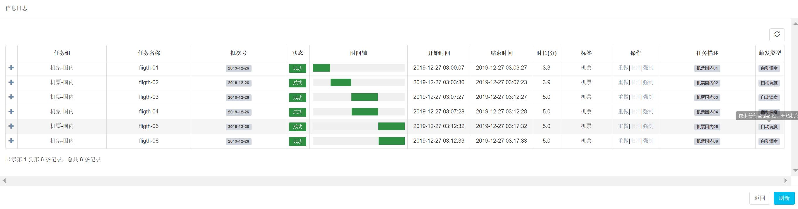
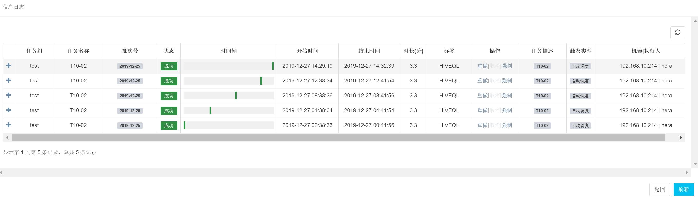

[TOC]

## 任务详情模块

### 任务详情-主页面

- 任务组与任务的展开子页面内容不一样
- 筛选条件，增加开始日期与结束日期

###  任务详情-组子页面

- 组下的任务执行历史情况(点击主页面的任务组，按开始时间升序)

###  任务详情-任务子页面

- 同一个任务执行历史情况(点击主页面的任务，按开始时间降序)

###  子页面的功能说明

#### 时间轴

- 当前任务的执行的时间区间

#### 操作

说明：对于当前任务的手动可操作的一系列动作。

- 重做：包含【重做当前】和【重做后续】，相当于之前版本的【手动执行】与【手动恢复】
- 取消：取消正在执行的任务
- 强制：直接将任务的状态值，强制设置为【失败】、【成功】、【等待】

备注：3个选项的可见性，较为简单，未细分，可进一步优化(如若当前状=成功，则强制成功为不可见，目前就未实现)

